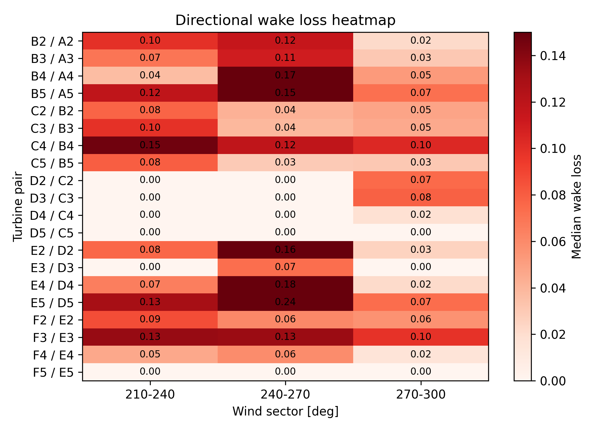
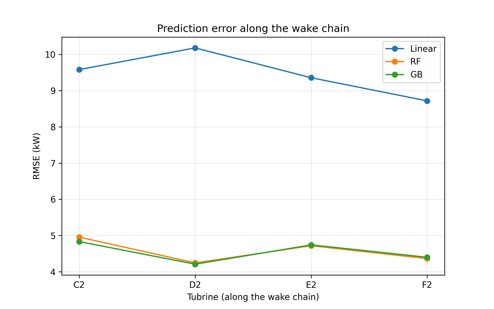
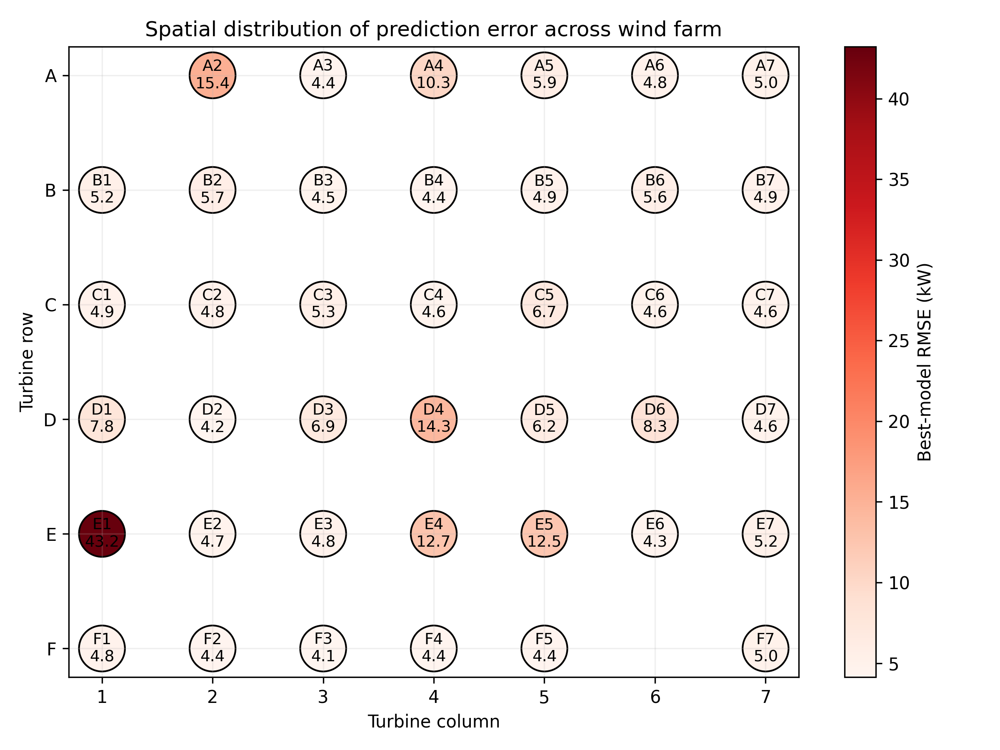
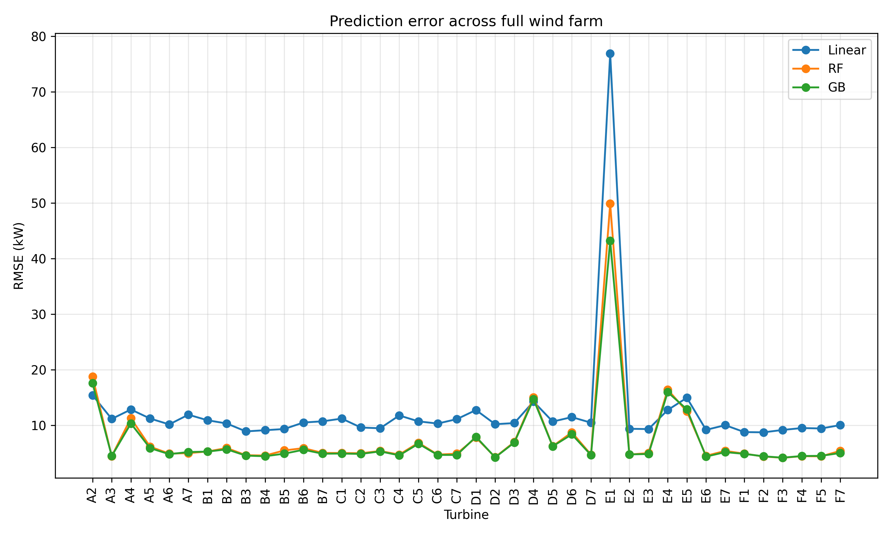

# Wind Farm SCADA Analysis: Power Curves, Wake Effects, and Machine Learning

## Project Overview

This project presents a structured analysis of wind farm SCADA data, combining engineering understanding of turbine behavior with machine learning techniques.

The work is organized into three stages:

- **Sprint 2** — Power curve analysis and data validation  
- **Sprint 3** — Wake effects and wind farm geometry  
- **Sprint 4** — Machine learning power prediction  

The goal is to understand both **how turbines behave physically** and **how well their power output can be predicted using data-driven models**.

---

## Objectives

- Validate turbine behavior using SCADA power curves  
- Identify and quantify wake effects across the wind farm  
- Build machine learning models to predict turbine power output  
- Compare model performance across turbines and flow conditions  
- Analyze how wake interactions influence prediction accuracy  

---

## Dataset

The analysis is based on a DTU wind farm SCADA dataset:

- ~72,000 timestamps  
- 10-minute resolution  
- ~1.4 years of operation  
- 42 turbines arranged in a grid (rows A–F, columns 1–7)  

Signals used include:

- Turbine power output  
- Nacelle wind speed  
- Yaw misalignment  
- Mast wind speed  
- Mast wind direction  

> ⚠️ The dataset is **not included** in this repository due to size and licensing constraints.  
> To run the notebooks, place the dataset file in the `data/` folder.

---

## Repository Structure
wind-farm-ml-analysis/
│
├── notebooks/
│ ├── sprint2_power_curve.ipynb
│ ├── sprint3_wake_effects_analysis.ipynb
│ └── sprint4_machine_learning_power_prediction.ipynb
│
├── figures/
│ ├── sprint3_wake_loss_heatmap.png
│ ├── sprint4_prediction_error_wake_chain.png
│ ├── sprint4_distribution_of_error_full_wf.png
│ ├── sprint4_pred_error_full_wf.png
│ └── ...
│
├── data/ # dataset not included
├── README.md
├── requirements.txt
└── .gitignore

---

## Methodology

### Feature Engineering
- Average mast wind speed  
- Circular encoding of wind direction (`sin`, `cos`)  
- Previous power as lagged feature  

### Models
- Linear Regression  
- Random Forest  
- Gradient Boosting  

### Evaluation Metrics
- MAE (Mean Absolute Error)  
- RMSE (Root Mean Squared Error)  

---

## Key Results

### Wake effects are visible in turbine power losses

Wake losses were identified using upstream/downstream turbine relationships.  
Strong wake effects occur when wind aligns with turbine rows.

---

### Prediction accuracy varies along wake chains

Prediction error does not change monotonically downstream.  
Turbines in stable wake conditions can be easier to predict than both upstream turbines and turbines exposed to more complex wake interactions.

---

### Prediction difficulty is spatially structured

Most turbines achieve low prediction error (~4–6 kW), while a few turbines show significantly higher error due to complex inflow or data variability.

---

### Tree-based models outperform linear regression

Random Forest and Gradient Boosting consistently provide better performance than linear models, highlighting the nonlinear nature of turbine power generation.

---

## Key Insights

- Wind turbine power prediction is inherently nonlinear  
- Wake effects influence both turbine performance and predictability  
- Stable wake regions can improve prediction accuracy  
- Prediction error varies spatially across the wind farm  
- Model tuning has limited impact when physical complexity dominates  

---

## Notebooks

### Sprint 2 — Power Curve Analysis
- SCADA data cleaning  
- Empirical power curve generation  
- Residual and variability analysis  

---

### Sprint 3 — Wake Effects Analysis
- Wind farm geometry reconstruction  
- Wind direction analysis  
- Upstream/downstream turbine identification  
- Wake loss estimation and mapping  

---

### Sprint 4 — Machine Learning Prediction
- Feature engineering  
- Model training and comparison  
- Wake-chain prediction analysis  
- Full wind farm error mapping  
- Hardest turbine tuning (E1 case study)  

---

## How to Run

### 1. Clone the repository
git clone https://github.com/kacper1002/wind-farm-scada-ml-analysis.git
cd wind-farm-scada-ml-analysis

### 2. Clone the repository
pip install -r requirements.txt

### 3. Add dataset
Place your data set file in:
data/

### 4. Run notebooks
Open and run in order:

1. notebooks/sprint2_power_curve.ipynb

2. notebooks/sprint3_wake_effects_analysis.ipynb

3. notebooks/sprint4_machine_learning_power_prediction.ipynb

## Future work
- Include turbulence intensity and additional physical features

- Test advanced models (e.g. XGBoost, LightGBM)

- Develop generalized models across turbines

- Incorporate time-series forecasting

- Add wake-aware features from upstream turbines

## Author
Kacper Szczykno
MSc Wind Energy - Technical University of Denmark (DTU)

## Final note
This project demonstrates how combining machine learning with engineering understanding provides deeper insight into wind farm behavior, while also highlighting the limitations imposed by complex physical processes.