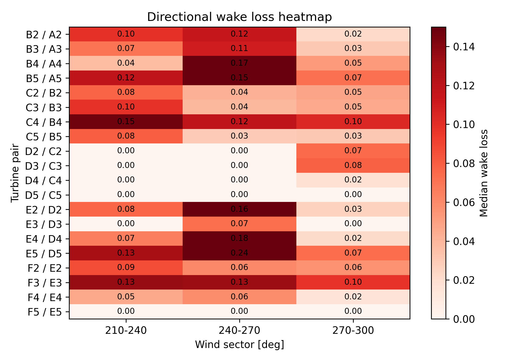
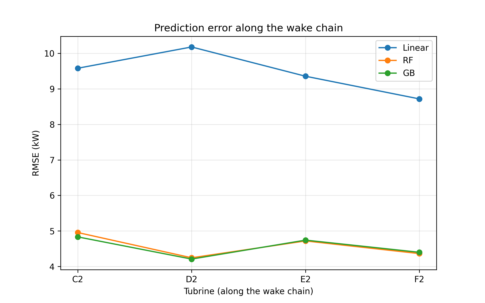
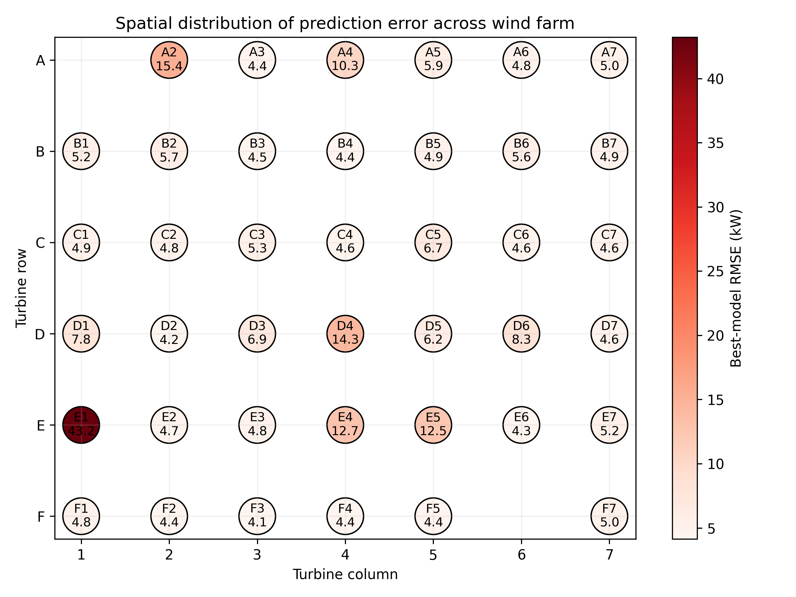
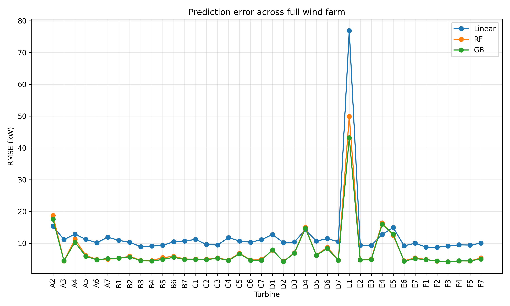

# Wind Farm SCADA Analysis: Power Curves, Wake Effects, and Machine Learning

> End-to-end wind farm SCADA analysis combining turbine performance validation, wake-effect analysis, and machine learning-based power prediction.

---

## Overview

This project analyzes wind farm SCADA data from the DTU Norre M2 wind farm dataset. The work combines **wind-energy engineering**, **wake-flow reasoning**, and **machine learning** to understand how turbine position and wake interactions influence both power production and prediction accuracy.

The project is structured as a progressive workflow:

1. **Power curve analysis** — validate turbine behavior and SCADA signal quality
2. **Wake analysis** — reconstruct wake interactions from turbine geometry and wind direction
3. **Machine learning prediction** — predict turbine power output from SCADA features
4. **Full wind farm analysis** — map prediction performance spatially across the farm
5. **Hardest-turbine investigation** — test whether model tuning can solve difficult prediction cases

The main idea is not only to train models, but to connect prediction performance back to the physical behavior of the wind farm.

---

## Objectives

- Validate turbine power behavior using SCADA-based power curves
- Detect and quantify wake effects using turbine-pair power ratios
- Reconstruct upstream/downstream turbine relationships from wind farm geometry
- Build machine learning models for turbine power prediction
- Compare linear and nonlinear regression models
- Analyze prediction error along wake chains and across the full wind farm
- Investigate whether poor prediction performance is caused by model limitations or physical/data complexity

---

## Dataset

The analysis is based on the **DTU Norre M2 wind farm SCADA dataset**.

### Dataset Characteristics

- Approximately **72,000 timestamps**
- **10-minute resolution**
- Around **1.4 years** of operation
- **42 turbines** arranged in rows A-F and columns 1-7
- Turbine-level and mast-level SCADA channels

### Signals Used

The analysis uses signals such as:

- turbine power output (`*_pow`)
- nacelle wind speed (`*_wsn`)
- yaw misalignment (`*_ym`)
- mast wind speed
- mast wind direction
- turbine position / layout information

### Data Source

The dataset is part of the DTU Wind Energy FAIR data initiative:

[DTU Norre M2 Dataset Documentation](https://gitlab.windenergy.dtu.dk/fair-data/winddata-revamp/winddata-documentation/-/blob/0bf7ca74c028c2791dedea66a028d0a4edbcc4e0/norre_m2.md)

> The raw dataset is **not included** in this repository due to file size and access restrictions. To run the notebooks, download the data separately and place it in the `data/` folder.

---

## Repository Structure

```text
wind-farm-scada-ml-analysis/
│
├── notebooks/
│   ├── sprint2_power_curve.ipynb
│   ├── sprint3_wake_effects_analysis.ipynb
│   └── sprint4_machine_learning_power_prediction.ipynb
│
├── figures/
│   ├── sprint3_wake_loss_heatmap.png
│   ├── sprint4_prediction_error_wake_chain.png
│   ├── sprint4_distribution_of_error_full_wf.png
│   ├── sprint4_pred_error_full_wf.png
│   └── ...
│
├── data/                # dataset not tracked in Git
│
├── README.md
├── requirements.txt
└── .gitignore
```

---

## Project Workflow

### Sprint 2 — Power Curve Analysis

The first stage focuses on validating the SCADA data and understanding turbine power behavior.

Main tasks:

- load and inspect SCADA variables
- clean missing and invalid values
- plot turbine power curves
- create empirical power curves
- analyze residuals and variability
- identify operating regions with high scatter

Engineering focus:

- verify that the turbine follows expected nonlinear power-curve behavior
- understand the spread in the ramp-up and rated regions
- establish a physically meaningful baseline before wake and ML analysis

---

### Sprint 3 — Wake Effects Analysis

The second stage investigates wake effects using wind farm geometry and SCADA-based turbine power ratios.

Main tasks:

- reconstruct wind farm layout
- validate turbine spacing using rotor diameter scaling
- analyze wind direction statistics and dominant wind sectors
- project turbine coordinates into wind-aligned reference frames
- identify upstream/downstream turbine pairs
- define wake chains across turbine rows
- calculate wake losses using power ratios
- compare wake losses across wind direction sectors
- map wake losses spatially across the farm

Engineering focus:

- connect turbine position, inflow direction, and downstream power loss
- show that wake effects are strongest when wind aligns with turbine rows
- demonstrate that wake losses can be detected directly from SCADA data

---

### Sprint 4 — Machine Learning Power Prediction

The final stage builds machine learning models for turbine power prediction and evaluates how prediction performance changes across the farm.

Main tasks:

- build a single-turbine ML pipeline
- engineer wind and operational features
- compare regression models
- analyze model errors versus wind speed
- extend the workflow to wake-affected turbines
- evaluate prediction error along a wake chain
- apply the model pipeline to the full wind farm
- identify difficult turbines
- tune the most difficult turbine case

Features used:

- nacelle wind speed
- yaw misalignment
- average mast wind speed
- wind direction encoded as `sin` and `cos`
- previous turbine power as a lag feature

Models evaluated:

- Linear Regression
- Random Forest
- Gradient Boosting

Metrics:

- MAE — Mean Absolute Error
- RMSE — Root Mean Squared Error

---

## Selected Results

### Wake effects are visible in turbine power losses



Wake losses were calculated using upstream/downstream turbine power ratios. The strongest wake effects appeared when inflow aligned with turbine rows, especially in dominant south-west to west wind sectors.

---

### Prediction error changes along a wake chain



Prediction error did not change monotonically downstream. Some turbines in stable wake regions were easier to predict than turbines exposed to more variable inflow or complex multi-wake interactions.

This shows that wake effects influence **predictability**, not only power production.

---

### Prediction difficulty is spatially structured across the wind farm



Applying the same ML pipeline across the full wind farm revealed strong spatial patterns in prediction error.

Most turbines achieved low prediction error, typically around **4-6 kW RMSE** with tree-based models. A small number of turbines were significantly harder to predict, suggesting local flow complexity, unstable inflow, or possible data-quality limitations.

---

### Tree-based models outperform linear regression for most turbines



Random Forest and Gradient Boosting generally outperformed the linear baseline, confirming that wind turbine power prediction is strongly nonlinear.

However, in some unstable or noisy cases, simpler models were more robust, showing that higher model complexity is not always the best solution.

---

## Key Findings

### 1. SCADA power curves provide a strong physical validation step

The turbine power curves showed the expected nonlinear behavior, including:

- low-power cut-in region
- steep ramp-up region
- rated-power plateau
- increased scatter near transition and rated operation

This confirmed that the dataset was suitable for further performance and ML analysis.

### 2. Wake effects are detectable using turbine-pair comparisons

Wake losses were clearly visible when turbine rows aligned with the incoming wind direction. Using turbine power ratios made it possible to estimate downstream deficits and compare wake strength across sectors.

### 3. Wake effects influence model predictability

A key result was that wake-affected turbines were not always harder to predict. Turbines located in stable wake regions sometimes produced smoother power signals and lower prediction error.

This highlights an important distinction:

- wake effects reduce available power
- stable wake conditions can increase predictability

### 4. Prediction error is spatially heterogeneous

Full-farm analysis showed that prediction difficulty varies strongly across the wind farm. The hardest turbines were not random; they appeared linked to turbine position, wake exposure, and local flow variability.

### 5. Model tuning has limited value when physics dominates

The most difficult turbine case was tuned using Gradient Boosting hyperparameters. Tuning improved RMSE by only about **5%**, and the best model used a simpler structure.

This suggests that the main limitation was not model configuration alone, but underlying physical complexity, missing explanatory variables, or data-quality issues.

---

## Engineering Insights

- Wind turbine power prediction is not just a machine learning problem; it is strongly shaped by turbine physics and wake interactions.
- Nonlinear models are usually necessary, but model complexity must be balanced against robustness.
- Stable wake regions can be easier to predict than highly variable free-stream or multi-wake conditions.
- Spatial mapping of ML error is useful for identifying turbines with unusual behavior.
- Model performance should always be interpreted together with wind farm layout and flow conditions.

---

## How to Run

### 1. Clone the repository

```bash
git clone https://github.com/kacper1002/wind-farm-scada-ml-analysis.git
cd wind-farm-scada-ml-analysis
```

### 2. Install dependencies

```bash
pip install -r requirements.txt
```

### 3. Add the dataset

Place the downloaded dataset in the `data/` folder.

Example expected path:

```text
data/norre_m2_all.nc
```

### 4. Run notebooks

Recommended order:

1. `notebooks/sprint2_power_curve.ipynb`
2. `notebooks/sprint3_wake_effects_analysis.ipynb`
3. `notebooks/sprint4_machine_learning_power_prediction.ipynb`

---

## Technologies Used

- Python
- pandas
- NumPy
- xarray
- matplotlib
- scikit-learn
- Jupyter Notebook
- Git / GitHub

---

## Future Work

Possible extensions:

- add turbulence intensity and additional physical predictors
- include explicit upstream turbine features
- test advanced boosting libraries such as XGBoost or LightGBM
- compare turbine-specific models with generalized farm-wide models
- develop park-level power prediction
- explore time-series forecasting methods
- connect the workflow to digital-twin or condition-monitoring use cases

---

## Author

**Kacper Szczykno**  
MSc Wind Energy — Technical University of Denmark (DTU)

---

## Final Note

This project demonstrates how combining SCADA analytics, wake physics, and machine learning can provide deeper insight into wind farm behavior. It also shows that data-driven models are ultimately constrained by the physical complexity of the system they represent.
